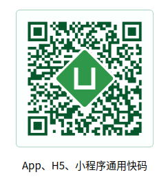

## uni-app基础学习笔记
#### 1. uni-app介绍
uni-app 是一个使用 Vue.js 开发跨平台应用的前端框架，一套代码可编译到iOS、Android、H5、小程序（微信/支付宝/百度/头条/QQ/钉钉）等多个平台（可以通过条件编译区分各平台特殊代码）。uni-app完整支持vue生命周期和模板语法，如果会vue基本上就可以解决大多数问题了，学习成本非常低。(暂时绕开了原生APP开发相关如nvue，h5+等内容)  
  
官方演示用例(https://github.com/dcloudio/hello-uniapp )可快速体验和学习框架的常用组件和案例  


#### 2. uni-app编码统一规范
   + 页面组件遵循Vue 单文件组件 (SFC) 规范  
   + 组件标签靠近微信小程序规范  
   + 接口能力（JS API）靠近微信小程序规范  
   + 数据绑定及事件处理靠近 Vue.js 规范，同时补充了App及页面的生命周期  
   + 为兼容多端运行，建议使用flex布局进行开发  

#### 3. 创建uni-app项目注意事项
   + 可通过HBuilderX可视化界面、vue-cli命令行两种方式快速创建项目。  
   + 官方推出的 HBuilderX 编辑器，内置相关环境，开箱即用  
   + uni-app在发布到H5时支持所有vue的语法  
   + cli版如果想安装less、scss、ts等编译器，需自己手动npm安装。在HBuilderX的插件管理界面安装无效，那个只作用于HBuilderX创建的项目。  
   + HBuilderX云打包可以使用Dcloud公用开发者证书进行测试，或者使用自己的开发者证书。  

#### 4. 项目迁移注意事项
###### (1)  H5项目迁移至uni-app  
   + 后缀名是.html，需要改为.vue，并注意遵循vue单文件组件SFC规范
   + uni-app默认是小程序的路由方式(pages.json管理页面)，如果使用vue-rooter的话可以使	   用uni-simple-router等第三方插件做兼容
   + 静态文件挪到static目录（静态资源只能存放于此）
   + 使用scroll-view、swiper等原生组件替换H5组件
   + audio组件使用uni.getBackgroundAudioManager()替换
   + v-html使用rich-text组件或uparse扩展插件替换
   + uni-app非H5端不支持window、navigator、document等web专用对象，使用条件编译区	   分
   + 不支持 *选择器及部分新的css  
 
###### (2) 微信小程序转换uni-app指南及转换器：https://ask.dcloud.net.cn/article/35786

#### 5. 关于uni-app生命周期
uni-app 完整支持 Vue 实例的生命周期，此外新增应用生命周期及页面生命周期。
<table><tr><th colspan="2" style="text-align:left;">应用生命周期</th></tr>
<tr><td>onLaunch</td><td>初始化完成时触发（全局只触发一次）</td></tr>
<tr><td>onShow</td><td>启动或从后台进入前台显示时触发</td></tr>
<tr><td>onHide</td><td>从前台进入后台时触发</td></tr>
<tr><td>onError</td><td>报错时触发</td></tr>
<tr><td>onUniNViewMessage</td><td>监听nvue页面发送的数据</td></tr></table>
注:应用生命周期仅可在App.vue中监听，在其它页面监听无效。在onlaunch生命周期内进行页面的跳转可能会和pages.json内配置的第一个页面跳转冲突,造成白屏，需要进行延时跳转。
<table style="text-align:left;"><tr><th colspan="2">页面生命周期（部分常用）</th></tr>
<tr><td>onLoad</td><td>监听页面加载，参数类型为Object，类似微信小程序</td></tr>
<tr><td>onShow</td><td>监听页面显示，包括从下级页面返回当前页面</td></tr>
<tr><td>onReady</td><td>监听页面初次渲染完成，如果渲染速度快，会在页面进入动画完成前触发</td></tr>
<tr><td>onPullDownRefresh</td><td>监听用户下拉动作，一般用于下拉刷新</td></tr>
<tr><td>onReachBottom</td><td>页面上拉触底事件的处理函数</td></tr>
<tr><td>onShareAppMessage</td><td>用户点击右上角分享(小程序)</td></tr>
<tr><td>onBackPress</td><td>监听页面返回(https://ask.dcloud.net.cn/article/35120)</td></tr></table>
关于.nvue页面(即Native vue)：uni-app App端内置 weex 渲染引擎，提供了原生渲染能力，但是weex提供的api不完整,nuve相当于给weex补充了大量组件和api，以及丰富的Plus API、Native.js、原生插件。(详情: https://ask.dcloud.net.cn/article/36074)

#### 6. 关于uni-app组件注意事项
   + 非H5端需要注意Slot不支持scoped，不支持动态组件、异步组件、inline-template、X-Templates、keep-alive、transition
   + uni-app 内置了小程序的所有组件，但原生组件上的事件绑定需要以vue语法来写(bindchange=”xxx”等改成@change=”xxx”)
   + uni-app组件有命名限制，组件名最好有特殊前缀或后缀(参考: https://uniapp.dcloud.io/use?id=%e5%91%bd%e5%90%8d%e9%99%90%e5%88%b6 )
   + uni-app内置了vuex
   + uni-app支持小程序自定义组件(wxcomponents目录下)，但是小程序组件的性能不如vue组件，不建议使用,另外小程序自定义组件只能在pages.json中配置 usingComponents,不支持页面引用。(参考:  https://ask.dcloud.net.cn/article/35786 )

#### 7. 条件编译
   + 用特殊的注释作为标记，在编译时根据这些特殊的注释，将注释里面的代码编译到不同平台。uni-app支持ifdef和ifndef(除了xx平台)，多个平台用||连接。例:
 ```
#ifdef H5||APP-PLUS
需条件编译的代码
#endif
```
   + 如果想把各平台的页面文件更彻底的分开，也可以在uni-app项目根目录创建platforms目录，然后在下面创建APP-PLUS、MP-WEIXIN等子目录，存放不同平台的文件。
   + 静态资源按不同平台区分的可在static目录下新建平台目录(注意使用小写，如：mp-weixin等)

#### 8. 部分常见问题及解决方案（参考官方文档避免官方已指出的不支持写法）
   + 各家小程序的浏览器内核不同，会造成css兼容性问题(参考：https://ask.dcloud.net.cn/article/1318 )
   + 各家小程序存在不一样的支持度(如：支付宝小程序不支持ECharts，百度小程序不支持v-if和for同时使用)，遇到相关问题可关注是否有相应版本更新或使用条件编译来不同平台不同处理。
   + 微信小程序端的原生组件存在层级问题，可以用cover-view、cover-image来进行覆盖
   + uni-app中可以使用upx作为自适应单位，但不支持动态绑定，可以使用uni.upx2px转化为px。
   + 关于Class 与 Style 绑定，非H5端支持简单的样式绑定，绑定的值只能是字符串，不支持复杂的绑定，比如:class="[class-a,class-b]"

#### 9. 使用总结
   + uni-app官方文档( https://uniapp.dcloud.io/README )非常详细，对于初学和使用uni-app非常有帮助
   + 因基本完整支持vue的语法及特性,uni-app的学习成本很低
   + 对于跨端uni-app最好是以小程序的编码方式为主向其他端扩展，参考以上第3条H5项目迁移至uni-app
   + 开发工具官方推荐HBuilderX，对于惯用Sublime/Atom等编辑器的开发者可以平滑过渡，其他开发者使用vue-cli的方式也很方便，但是仍然需要HbuilderX打包到安卓/IOS(无需打包原生APP的忽略)
   + 目前uni-app插件市场( https://ext.dcloud.net.cn/ )有1K+第三方插件，但是质量良莠不齐只能筛选后使用和参考
   + uni-app支持使用npm安装第三方包，但是为多端兼容考虑应优先从uni-app插件市场获取插件，直接从npm下载库很容易只兼容H5端，当然也可使用条件编译将该部分特殊处理

总体来说uni-app是一个非常好的跨平台开发框架，框架本身的文档也非常详细，但是目前开放生态并不是很完善，很多第三方插件文档也很模糊，如果单纯只开发某一个平台的代码可以绕开uni-app，但是如果是跨端需求则非常适合用uni-app，因为使用条件编译进行各平台的独有代码开发也没有增加工作量。uni-app在跨端抹平度、扩展灵活性、性能体验、学习成本、开发成本等方面都非常优秀(官方说的8个指标虽有广告成分但也确实很优秀)。