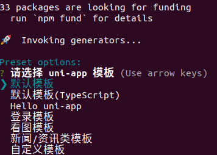
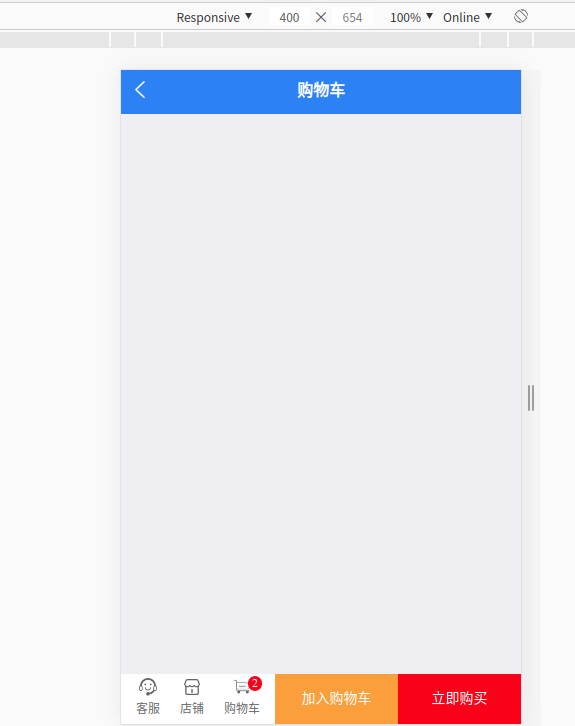
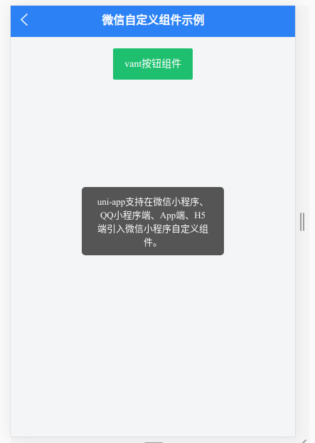

## uni-app中的各种组件
通过之前uni-app基础学习了解到uni-app是一个海纳百川的框架，它支持各种各样的组件及编码方式。虽然官网推荐使用插件市场的uni-app原生插件代替微信小程序等其他规范的组件，但更多的时候我们都有自己工作中积累的自定义组件，所以如何平滑的迁移到目标平台也是我们关注的一个重点。  
开始前的准备:  
+ 通过CLI创建项目  
`vue create -p dcloudio/uni-preset-vue my-test`
+ 选择默认模板新建一个空项目  

+ 以H5方式运行项目  
```
cd my-test
npm run serve
```
(由于写文时条件限制我的电脑是linux系统，没有安装微信/支付宝等开发者工具，以下运行效果图皆只有H5平台，后续补充)
#### 1. uni-app组件
uni-app组件大致分为内置组件、官方扩展组件、第三方uni-app插件，几乎所有组件都有各自自定义的属性，可以对该组件的功能或样式进行修饰  
+ uni-app内置组件是最常用的，与微信内置组件相同。基础组件分为以下八大类（以下列出部分组件的注意点）：  

<table>
	<tr>
    	<th>类别</th>
	    <th>组件</th>
	    <th>描述及注意事项</th>
	</tr >
	<tr >
	    <td rowspan="3">视图容器</td>
	    <td>view</td>
	    <td>视图容器，类似于HTML中的div</td>
	</tr>
	<tr>
	    <td>scroll-view</td>
	    <td>
        	1.scroll-view 不适合放长列表，有性能问题。长列表滚动和下拉刷新，应该使用原生导航栏搭配页面级的滚动和下拉刷新实现。<br/>
        	2.scroll-view是区域滚动，不会触发页面滚动，无法触发pages.json配置的下拉刷新、页面触底onReachBottomDistance、titleNView的transparent透明渐变。
        </td>
	</tr>
	<tr>
	    <td>swiper</td>
	    <td>
        		1.swiper是单页组件，适合做banner图轮播和简单列表左右滑动。<br/>
				2.因为性能问题，swiper不适合做复杂的长列表。
        </td>
	</tr>
	<tr>
    	<td rowspan="4">基础内容组件</td>
	    <td>icon</td>
	    <td>图标</td>
	</tr>
	<tr>
    	<td>text</td>
	    <td>
        	1.组件内只支持嵌套text组件，不支持其它组件或自定义组件，否则会引发在不同平台的渲染差异。
        	2.支持 \n 方式换行。
		</td>
	</tr>
    <tr>
    	<td>rich-text</td>
	    <td>富文本,支付宝小程序 nodes 属性只支持使用 Array 类型</td>
	</tr>
    <tr>
    	<td>progress</td>
	    <td>进度条</td>
	</tr>
	<tr>
	    <td rowspan="2">表单组件</td>
        <td>picker</td>
	    <td>弹出式列表选择器</td>
	</tr>
	<tr>
	    <td>picker-view</td>
	    <td>窗体内嵌式列表选择器</td>
	</tr>
	<tr>
    	<td >导航</td>
	    <td >navigator</td>
	    <td>页面链接。类似于HTML中的a标签</td>
	</tr>
    <tr>
    	<td rowspan="3" >媒体组件</td>
	    <td >audio</td>
	    <td>不再维护，使用uni.createInnerAudioContext 替代</td>
	</tr>
    <tr>
    	<td >live-player</td>
	    <td>直播播放</td>
	</tr>
    <tr>
    	<td >live-pusher</td>
	    <td>实时音视频录制，也称直播推流</td>
	</tr>
    <tr>
    	<td >媒体组件</td>
	    <td >audio</td>
	    <td>不再维护，使用uni.createInnerAudioContext 替代</td>
	</tr>
    <tr>
    	<td >地图</td>
	    <td >map</td>
	    <td>
        	组件的宽/高推荐写直接量，比如：750rpx，不要设置百分比值。<br/>
            uni-app 只支持 gcj02 坐标
        </td>
	</tr>
    <tr>
    	<td >画布</td>
	    <td >canvas</td>
	    <td>
        	1.默认宽度300px、高度 225px，大小后需要重新绘制<br/>
        	2.同一页面中的 canvas-id 不可重复,否则画布将被隐藏<br/>
        	3.微信、百度、QQ小程序中层级高于前端组件,不可内嵌在 scroll-view、swiper、picker-view、movable-view 中使用
        </td>
	</tr>
     <tr>
    	<td >webview</td>
	    <td >web-view</td>
	    <td>
        	1.小程序仅支持加载网络网页，不支持本地html<br/>
			2.小程序端 web-view 组件一定有原生导航栏，下面一定是全屏的 web-view 组件，navigationStyle: custom 对 web-view 组件无效。
        </td>
	</tr>
</table>
每个组件都有其特定的属性，详细
+ uni-app扩展组件(即uni-ui)是DCloud提供的一个跨端ui库，它是基于vue组件的、flex布局的、无dom的跨全端ui框架,它是基础组件的补充。  
   如果创建项目时没有选择`hello uni-app`模板，则可使用npm引入uni-ui  
   `npm install @dcloudio/uni-ui`  
   uni-ui目前小程序和混合app领域，暂时还没有比uni ui更高性能的框架。在满足业务条件的情况下不要使用自定义组件。 
   注:uni-ui 不支持使用 Vue.use() 的方式安装
+ uni-app第三方插件市场及本地自定义组件是对以上两种组件的补充

#### 2. vue组件
uni-app只支持vue单文件组件,所以在使用第三方组件如：npm引入某组件的时候应注意。有些原生vue支持的组件在uni-app中是错误的组件,例如：  
```
// uni-app不支持的组件
//  1.动态组件
<component v-bind:is="currentTabComponent"></component>
//  2.异步组件
Vue.component('async-example', function (resolve, reject) {
  setTimeout(function () {
    resolve({
      template: '<div>I am async!</div>'
    })
  }, 1000)
})
// 3.包含自定义render的组件
<script>
	...
	export default {
		data() {
			return { }
		},
        ...
        render (createElement) {
        	return createElement(...)
        }
     }
</script>
``` 
组件的引用兼容了vue及小程序  
使用方式1：在src目录下创建/component目录存放组件，以插件市场中的uni-goods-nav为例:  
   1. 插件市场中下载组件包(https://ext.dcloud.net.cn/plugin?id=865)
   2. 解压后将goods-nav目录放置在component目录下
   3. 引入插件、注册、使用，与常规vue开发一模一样  
   ```
   <template>
	<view>
		<view class="goods-carts">
			<uni-goods-nav :options="options" :button-group="buttonGroup" />
		</view>
	</view>
</template>
<script>
	import uniGoodsNav from '@/components/uni-goods-nav/uni-goods-nav.vue'
	export default {
		components: { uniGoodsNav },
		data() {
			return {
				options: [{
					icon: 'https://img-cdn-qiniu.dcloud.net.cn/uniapp/uni-ui/goodsnav/kefu.png',
					text: '客服'
				}, {
					icon: 'https://img-cdn-qiniu.dcloud.net.cn/uniapp/uni-ui/goodsnav/dianpu.png',
					text: '店铺'
				}, {
					icon: 'https://img-cdn-qiniu.dcloud.net.cn/uniapp/uni-ui/goodsnav/carts.png',
					text: '购物车',
					info: 2
				}],
				buttonGroup: [{
						text: '加入购物车',
						backgroundColor: '#ffa200 ',
						color: '#fff'
					},
					{
						text: '立即购买',
						backgroundColor: '#ff0000',
						color: '#fff'
					}
				]
			}
		}
	}
</script>
    ```  
使用方式2： 与方式1一样，但使用组件时与小程序一样在pages.json中引入组件  
```
{
    "path": "subPages/demo/uni-goods-nav",
    "style": {
            "navigationBarTitleText": "购物车",
            "usingComponents": {
            "uni-goods-nav": "/components/uni-goods-nav/uni-goods-nav"
    }
}
```
得到的效果:  

熟悉web开发的前端开发者都习惯从npm仓库中获取组件，所以很多时候觉得通过下载组件包然后解压的方式显得很怪异，实际上uni-app是支持npm方式引入组件的，只是这有很大风险会有部分平台不支持的问题。可以通过条件编译来屏蔽不支持的平台。以mpvue-echarts为例  
```
// npm安装包
npm install echarts mpvue-echarts --save
// echarts-weixin.vue
<template>  
    <div class="container">  
        <mpvue-echarts :echarts="echarts" :onInit="onInit" />  
    </div>  
</template>  
<script>  
    import * as echarts from 'echarts'  
    import mpvueEcharts from 'mpvue-echarts'  
    export default { 
     	components: {  mpvueEcharts  },  
        data() {  
            return {  
                echarts,  
                onInit: function (canvas, width, height) {
                ...
                }
            }  
        }
    }  
</script>
// echarts-h5.vue
<script>
import * as echarts from 'echarts'
var myChart = echarts.init(document.getElementById('echarts'));
myChart.setOption({
    ...
})
</script>
// pages.json
#ifdef MP-WEIXIN
{
    "path": "pages/demo/echarts-weixin",
    "style": {
        "navigationBarTitleText": "demo-echarts"
    }
},
#endif
#ifdef H5
{
    "path": "pages/demo/echarts-h5",
    "style": {
        "navigationBarTitleText": "demo-echarts"
    }
},
#endif
```

#### 3. 微信小程序组件
由于性能问题，开发中应尽量避免直接使用小程序的组件。但是uni-app仍然 支持在App 和 小程序 中使用小程序自定义组件。  
   1. 在项目src目录下新建小程序组件放置目录，微信及QQ-wxcomponents/支付宝-mycomponents/百度-swancomponents/头条-ttcomponents
   2. 在 pages.json 对应页面的 style -> usingComponents 引入组件
   3. 页面中使用组件

以有赞的vant-weapp button组件为例
1. 下载组件并放置到wxcomponents目录下:  
	`npm i @vant/weapp -S --production` 
    复制node_modules/@vant/weapp/dist/button到wxcomponents/vant/下
2. pages.json 中使用组件
```
{
  "usingComponents": {
    "van-button": "/wxcomponents/vant/button/index"
  },
  "navigationBarTitleText": "test-vant"
}
```
3. demo-test-wx.vue  
```
<template>
	<view>
		<view class="uni-common-mt" style="text-align: center;">
			<van-button type="primary" @click="onClick">vant按钮组件</van-button>
		</view>
	</view>
</template>
<script>
	export default {
		data() {
			return {
				checked: true
			};
		},
		methods: {
			onClick() {
				uni.showToast({
					title: "uni-app支持在微信小程序、QQ小程序端、App端、H5端引入微信小程序自定义组件。",
					mask: false,
					icon: "none",
					duration: 3000
				});
			}
		}
	}
</script>
<style>
</style>
```
效果：


